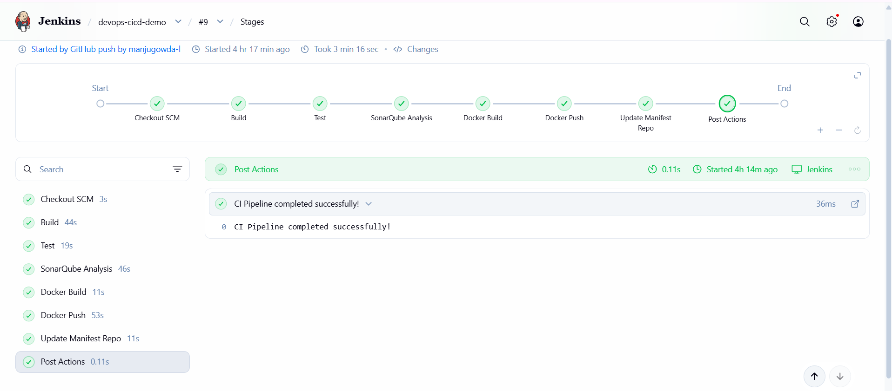
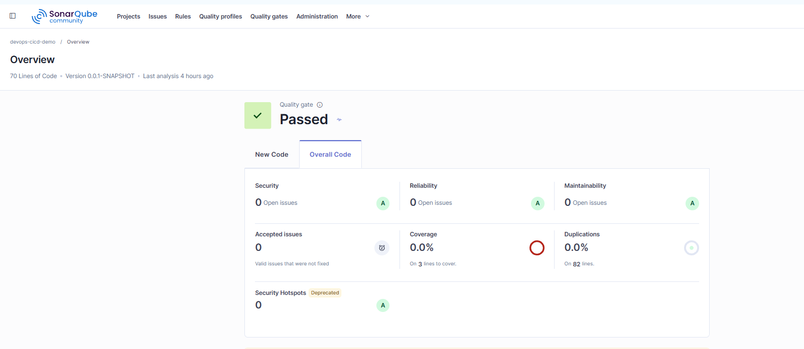
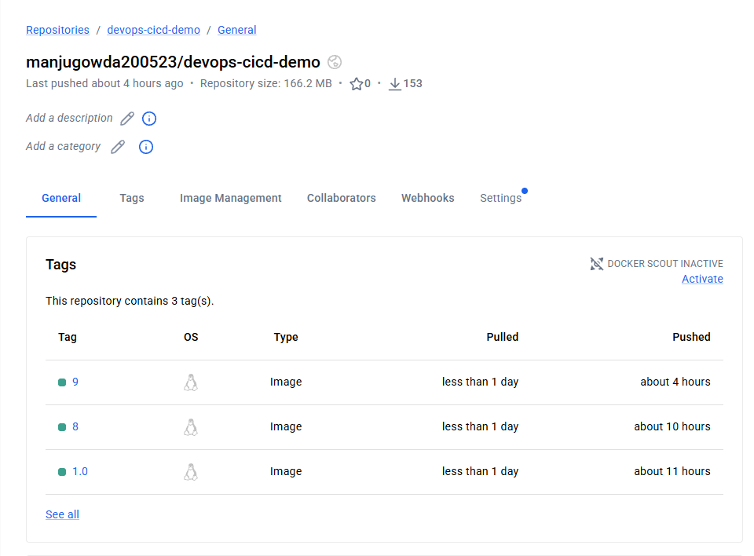
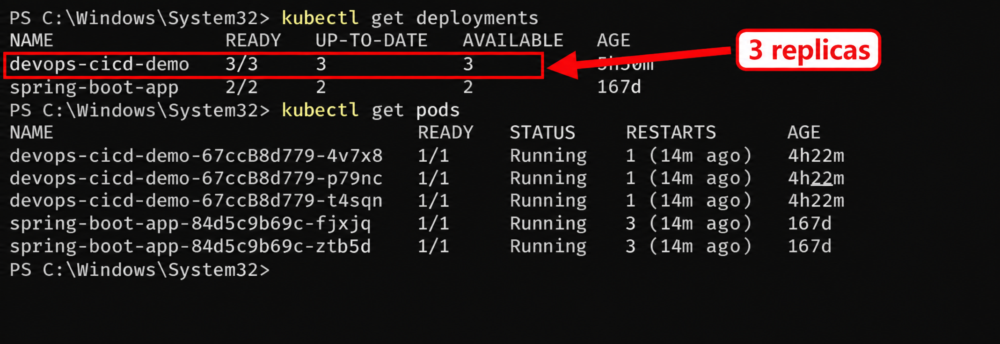
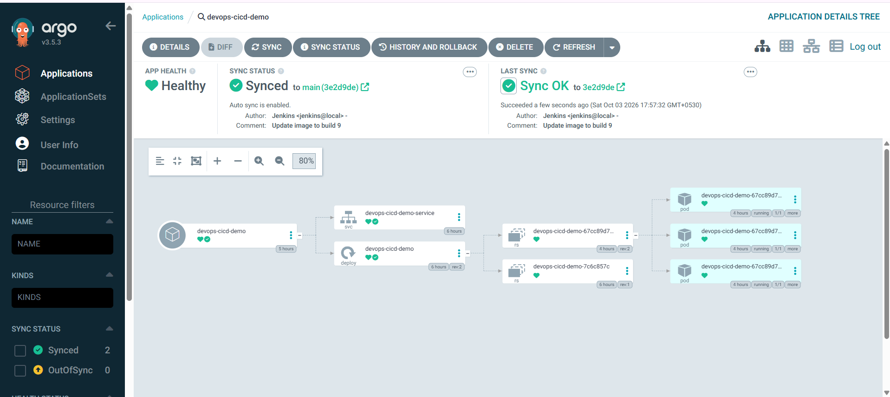
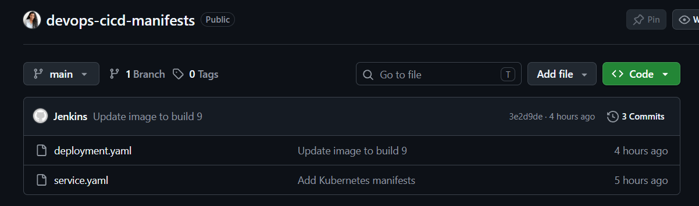

# DevOps CI/CD + GitOps Deployment

An end-to-end DevOps project that automates the complete software delivery lifecycle — from a developer pushing code to GitHub to the application running on Kubernetes.

The project combines **Jenkins, Maven, SonarQube, Docker, Docker Hub, Kubernetes, Minikube and Argo CD** to implement a complete CI/CD + GitOps workflow.

---

## Project Architecture


---

## Project Overview

The application is a Spring Boot application deployed to a Kubernetes cluster.

The complete workflow is automated using two GitHub repositories:

- **Application Repository** – contains the Spring Boot application and Jenkins pipeline.
- **Manifest Repository** – contains the Kubernetes deployment configuration.

A code push to the application repository triggers Jenkins automatically through a GitHub webhook.

Jenkins then builds, tests, analyzes, containerizes and publishes the application. After that, Jenkins updates the Kubernetes image version in the manifest repository.

Argo CD detects the Git change and automatically deploys the new version to Kubernetes.

---

## End-to-End Flow

```text
Developer
    │
    │ git push
    ▼
GitHub Application Repository
    │
    │ Webhook
    ▼
Jenkins
    │
    ├── Maven Build
    ├── Run Tests
    ├── SonarQube Analysis
    ├── Docker Build
    └── Docker Push
            │
            ▼
       Docker Hub
            │
            │
            ▼
Jenkins updates deployment.yaml
            │
            ▼
GitHub Manifest Repository
            │
            │ Git change detected
            ▼
         Argo CD
            │
            │ Auto Sync
            ▼
       Kubernetes
            │
            ▼
       Deployment
            │
            ▼
       ReplicaSet
            │
            ▼
          Pods
            │
            ▼
        Service
            │
            ▼
    Running Application
```

---

## Technology Stack

| Technology | Purpose |
|------------|---------|
| Java | Application development |
| Spring Boot | Backend application |
| Maven | Build and test automation |
| Git | Version control |
| GitHub | Source code and manifest repositories |
| GitHub Webhook | Jenkins pipeline trigger |
| Jenkins | CI/CD automation |
| SonarQube | Code quality analysis |
| Docker | Application containerization |
| Docker Hub | Container image registry |
| Kubernetes | Container orchestration |
| Minikube | Local Kubernetes cluster |
| Argo CD | GitOps continuous deployment |
| YAML | Kubernetes configuration |

---

## CI/CD Pipeline

The Jenkins pipeline is defined using a `Jenkinsfile` and contains the following stages.

### 1. Build

Maven builds and packages the Spring Boot application.

```text
Maven
  ↓
Compile
  ↓
Package
  ↓
Application JAR
```

### 2. Test

Automated tests are executed using Maven.

```text
Application
    ↓
Maven Test
    ↓
Test Result
```

### 3. SonarQube Analysis

SonarQube analyzes the application code for code quality and potential issues.

The pipeline successfully completed the SonarQube Quality Gate.

### 4. Docker Build

Jenkins creates a Docker image containing the Spring Boot application.

The image is tagged using the Jenkins build number.

```text
manjugowda200523/devops-cicd-demo:<BUILD_NUMBER>
```

For example:

```text
Build #9
    ↓
devops-cicd-demo:9
```

### 5. Docker Push

The generated image is pushed to Docker Hub.

### 6. Update Manifest Repository

After pushing the Docker image, Jenkins updates the image tag inside the Kubernetes `deployment.yaml`.

The updated manifest is committed and pushed to the separate GitHub manifest repository.

---

## GitHub Repositories

### Application Repository

The application repository contains the Spring Boot application and CI/CD configuration.

```text
devops-cicd-demo
│
├── src/
├── Dockerfile
├── Jenkinsfile
├── pom.xml
├── deployment.yaml
├── service.yaml
└── README.md
```

### Manifest Repository

The manifest repository contains the desired Kubernetes state.
https://github.com/manjugowda-l/devops-cicd-manifests

```text
devops-cicd-manifests
│
├── deployment.yaml
└── service.yaml
```

Keeping the Kubernetes manifests in a separate repository allows the application source and deployment configuration to be managed independently.

---

## Docker

The application is packaged as a Docker image using the following Dockerfile structure:

```text
Base Java Runtime
       ↓
   Working Directory
       ↓
   Application JAR
       ↓
   Expose Port 8080
       ↓
   Start Spring Boot
```

The Docker image is versioned using the Jenkins build number.

This makes each image traceable to a specific CI pipeline execution.

---

## Kubernetes Deployment

The application runs on a Kubernetes cluster created using Minikube.

The deployment uses the following Kubernetes resources:

```text
Deployment
     ↓
 ReplicaSet
     ↓
   Pods
     ↓
 Service
     ↓
Application
```

### Deployment

The Kubernetes Deployment manages the desired number of application replicas.

### ReplicaSet

The ReplicaSet ensures that the required number of Pods are running.

### Pods

The Pods run the Docker container containing the Spring Boot application.

### Service

A Kubernetes NodePort Service provides stable access to the application.

---

## Kubernetes Self-Healing

Kubernetes was tested by manually deleting a running application Pod.

```text
Running Pod
     ↓
Pod Deleted
     ↓
Kubernetes detects desired state mismatch
     ↓
New Pod created automatically
     ↓
Application running again
```

This demonstrated Kubernetes self-healing.

The application was also scaled to multiple replicas to demonstrate Kubernetes scaling.

---

## GitOps with Argo CD

Argo CD is used for continuous deployment.

Instead of Jenkins directly deploying the application to Kubernetes, Jenkins updates the desired Kubernetes configuration in Git.

Argo CD then takes responsibility for synchronizing Kubernetes with that Git state.

```text
Jenkins
   │
   │ updates image tag
   ▼
GitHub Manifest Repository
   │
   │ Argo CD detects change
   ▼
Argo CD
   │
   │ Auto Sync
   ▼
Kubernetes
```

### Argo CD Auto-Sync

Auto-Sync is enabled for the application.

When Jenkins changes the image version in the manifest repository:

```text
Git Change
    ↓
Argo CD detects change
    ↓
Automatic Sync
    ↓
Kubernetes Deployment Updated
    ↓
New ReplicaSet
    ↓
New Pods
```

---

## Deployment Update

For example, when Jenkins produces a new build:

```text
Docker Image

devops-cicd-demo:9
```

Jenkins updates the Kubernetes manifest:

```yaml
image: manjugowda200523/devops-cicd-demo:9
```

The change is committed to Git.

Argo CD detects the new desired state and synchronizes Kubernetes automatically.

Kubernetes then performs the application rollout and starts Pods using the new image.

---

## Screenshots

### Jenkins Pipeline



The Jenkins pipeline shows the automated CI stages including build, testing, SonarQube analysis, Docker build, Docker push and manifest update.

---

### SonarQube



SonarQube successfully analyzes the application and the Quality Gate passes.

---

### Docker Hub



The Docker image generated by Jenkins is available in the Docker Hub repository with build-number based tags.

---

### Kubernetes



The application is running as Kubernetes Pods managed by the Deployment and ReplicaSet.

---

### Argo CD



Argo CD shows the application synchronized with the Git manifest repository and Auto-Sync enabled.

---

### GitOps Deployment



The updated Kubernetes manifest is automatically synchronized from Git to the Kubernetes cluster.

---

## Complete Deployment Lifecycle

```text
                    SOURCE
                      │
                      ▼
              GitHub Application
                      │
                      ▼
                GitHub Webhook
                      │
                      ▼
                    JENKINS
                      │
          ┌───────────┼───────────┐
          ▼           ▼           ▼
       Maven       SonarQube    Docker
       Build       Analysis      Build
          │                       │
          ▼                       ▼
        Tests                 Docker Hub
                                  │
                                  ▼
                       Manifest Repository
                                  │
                                  ▼
                              Argo CD
                                  │
                              Auto Sync
                                  │
                                  ▼
                            Kubernetes
                                  │
                                  ▼
                              Pods
                                  │
                                  ▼
                             Service
                                  │
                                  ▼
                        Running Application
```

---

## Project Result

The complete CI/CD and GitOps workflow was successfully implemented and tested.

A single application code change can travel through the complete pipeline:

```text
Git Push
   ↓
GitHub
   ↓
Jenkins
   ↓
Maven Build
   ↓
Tests
   ↓
SonarQube
   ↓
Docker Build
   ↓
Docker Hub
   ↓
Manifest Update
   ↓
GitHub Manifest Repository
   ↓
Argo CD
   ↓
Kubernetes
   ↓
New Application Version
```

The project demonstrates practical implementation of:

**Continuous Integration + Containerization + Kubernetes + GitOps + Continuous Deployment**

---

## Project Repository Structure

```text
devops-cicd-demo/
│
├── architecture/
│   └── architecture.png
│
├── screenshots/
│   ├── jenkins-pipeline.png
│   ├── sonarqube.png
│   ├── docker-hub.png
│   ├── kubernetes.png
│   ├── argocd.png
│   └── gitops-deployment.png
│
├── src/
├── Dockerfile
├── Jenkinsfile
├── pom.xml
├── deployment.yaml
├── service.yaml
└── README.md
```

---

## Author

**Manju L**

Cloud & DevOps | AWS | Docker | Kubernetes | Jenkins | GitOps
